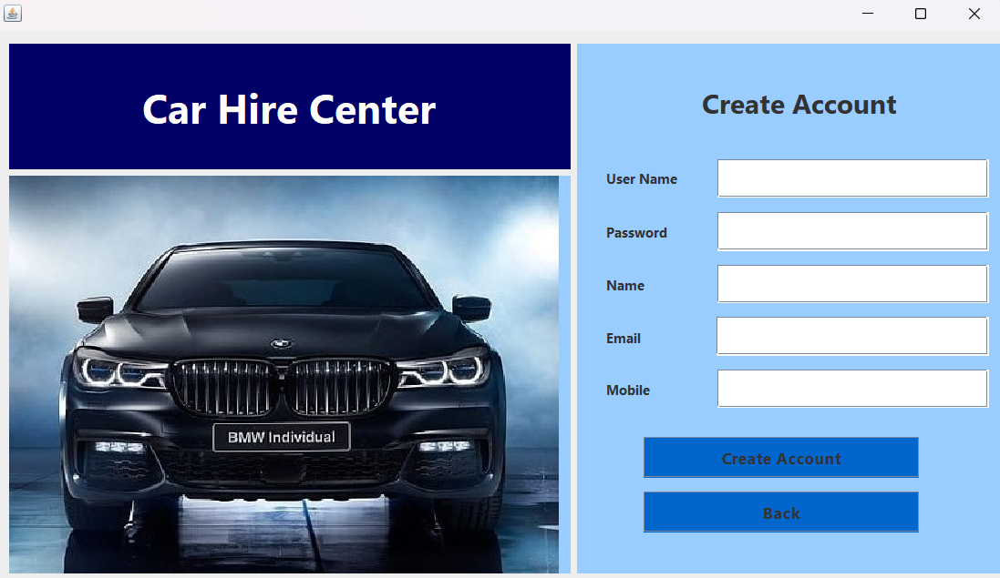
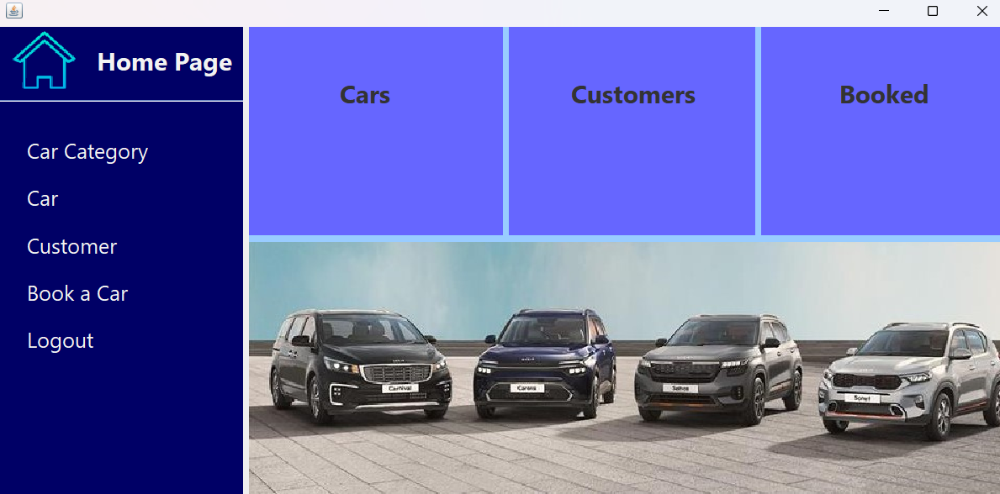
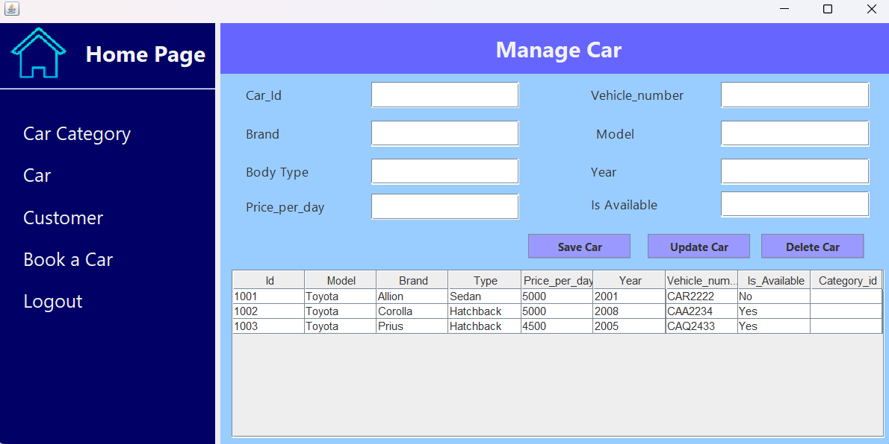
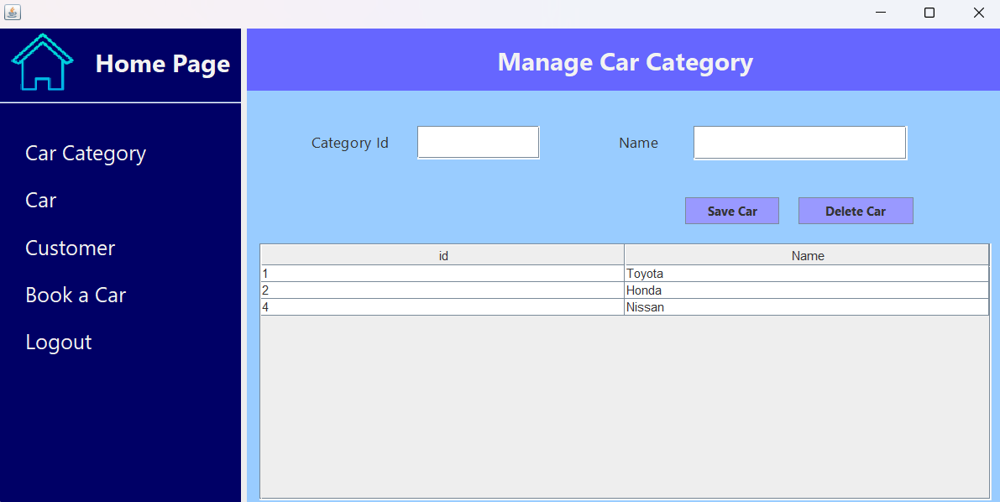
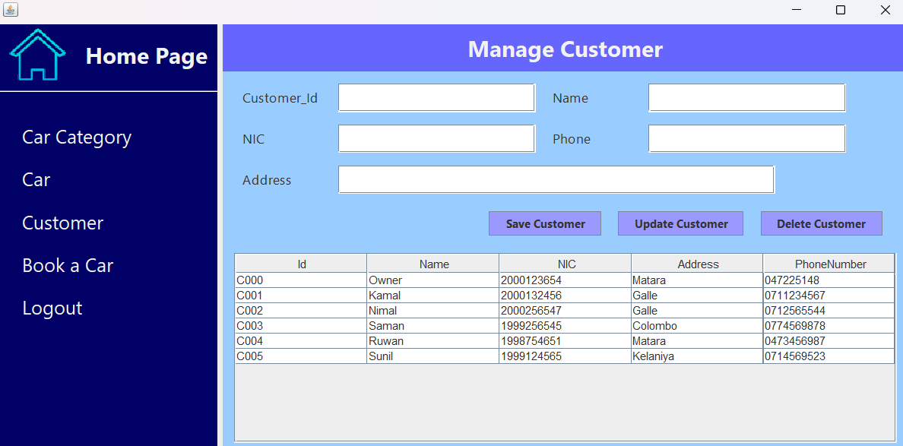
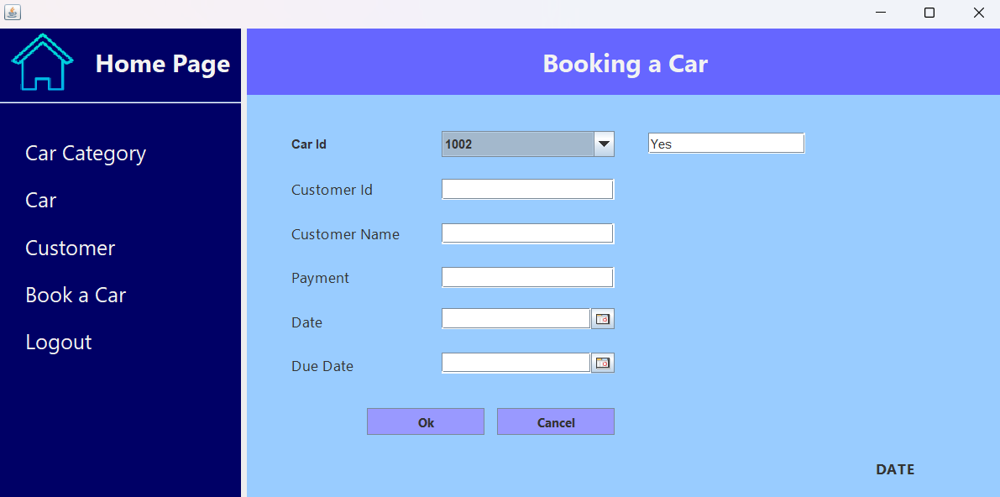

## **🚗 Car Rental Management System**
<br>

This Java Swing-based Car Rental Management System is designed for rental shop owners to efficiently manage their fleet, track bookings, and handle customer rentals with ease.

## **🌟 Features**

- **Car Management**: Add, edit, and remove cars from the system.  
- **Customer Management**: Store and manage customer details.  
- **Car Category Management**: Display and mange customer categories.  
- **Rental Processing**: Rent out cars and track active bookings.  
- **Database Integration**: Uses MySQL for data storage.  

---

## **🛠️ Technologies Used**

- **Java Swing**: GUI Development
- **JDBC**: Database Connectivity
- **MySQL**: Data Management
- **NetBeans**: IDE Support   

---

## **📸 Screenshots**

<table>
  <tr>
    <td></td>
    <td></td>
    <td></td>
  </tr>
  <tr>
    <td></td>
    <td></td>
    <td></td>
  </tr>
</table>


> **Note**: Screenshots are in the `images` folder in project directory.

---

## **🚀 Installation & Usage**

**Clone the repository :**  
   ```bash
   git clone https://github.com/ThasuniInduma/carhire-layered.git
   cd carhire-layered
